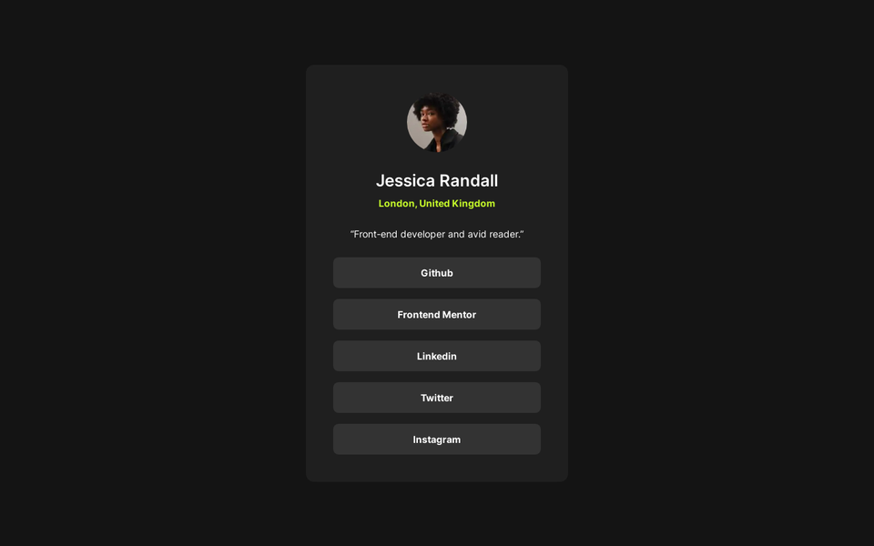

# Social Links Profile



## Hello World!

This is a website with a simple profile card with some social links. This is also my solution to the ["Social links profile" challenge by Frontend Mentor](https://www.frontendmentor.io/challenges/social-links-profile-UG32l9m6dQ).

Honestly, I built this just to satisfy my desire to test Tailwind CLI and Bun together. This is the first time I've used Bun.

## Technologies Used

I used HTML + Tailwind CSS to create the UI and Bun + TypeScript to build the website for production (see [the build script](scripts/build.ts)).

This script uses Tailwind CLI to generate a minified CSS file from the used classes and the package [html-minifier-terser](https://www.npmjs.com/package/html-minifier-terser) to minify the HTML.

## Run Yourself

> Make sure you have Git or GitHub CLI and Bun installed before continue. See [how to install Bun](https://bun.sh/docs/installation) and [how to install Git](https://git-scm.com/book/en/v2/Getting-Started-Installing-Git) if you need to.

First, clone this repository, go to the created folder and install the dependencies:

```sh
git clone https://github.com/dcdm3g/social-links-profile
cd social-links-profile
bun install
```

Then, you can run the development command:

```sh
bun dev
```

This command start the Tailwind CLI in watch mode, so you can edit HTML classes and a new CSS file will be generated automatically.

You can also build the website for production using the build command:

```sh
bun run build
```

This command runs the build script, that creates the `public` folder containing the assets and the minified HTML and CSS.